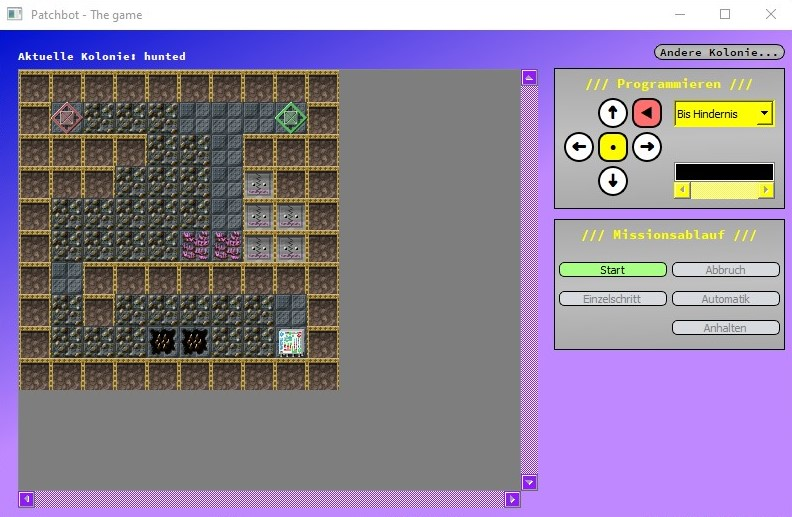

Patchbot - University assignment
================================

The task was to create a game. To be honest: it is not the most amazing game I've ever came across, but it is ok for wasting some time.

If you want to play this game (only windows):
---------------------------------------------
patchbot.zip is everything you need: Just extract the archive into a folder and run patchbot_qt.exe OR run it directily out of the zip-Archive.

Note: Maps are saved in the folder /txt.

Look at the amazing UI (LSD warning):

**AMAZING <3**
